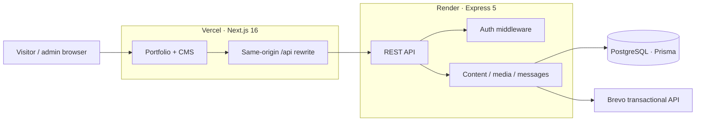
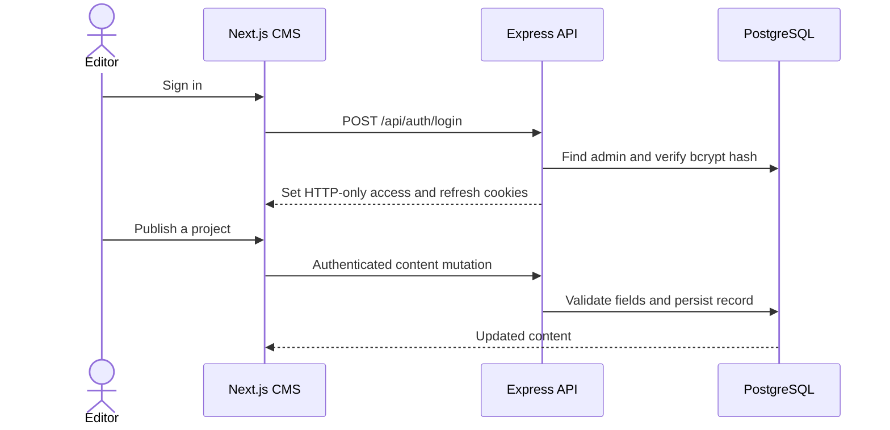
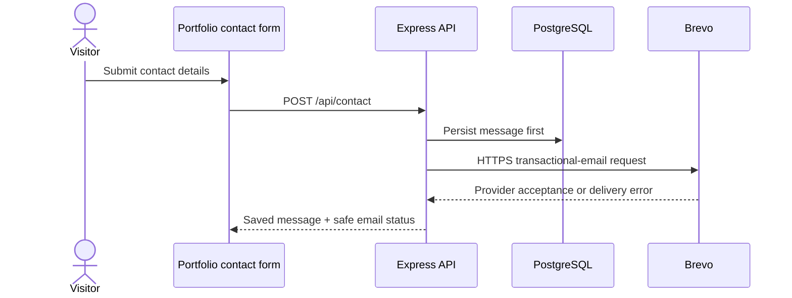

<div align="center">


### A portfolio engineered as a product—not just a landing page.

[](https://nextjs.org/)
[](https://react.dev/)
[](https://www.typescriptlang.org/)
[](https://expressjs.com/)
[](https://www.postgresql.org/)
[](https://vercel.com/)
[](https://render.com/)


**Electric gold · pure black · thoughtfully engineered**

[GitHub repository](https://github.com/SaurabhPandey016/Personal_portfolio) · [GitHub profile](https://github.com/SaurabhPandey016) · [LinkedIn](https://www.linkedin.com/in/saurabhpandey-/) · [Email](mailto:developersaurabh04@gmail.com) · [Client guide](./client/README.md) · [API guide](./server/README.md)

</div>

---

## Project brief

This project turns a personal portfolio into a maintainable, full-stack publishing platform. Visitors get a fast, responsive presentation of selected work; the owner gets a private CMS for updating that work, handling inbound messages, and reusing uploaded media—without editing page code for routine content changes.

The architecture separates the **Next.js web client** from the **Express API**. PostgreSQL is the system of record for content, admin accounts, contact messages, and media bytes. Prisma defines the schema and runs versioned migrations.

> **Recruiter snapshot**
> End-to-end product ownership across UI, API, authentication, relational data modeling, file handling, email-provider integration, testing, and deployment documentation.

### At a glance

| Dimension | Implementation |
| --- | --- |
| Product | Public developer portfolio + private content-management workspace |
| Frontend | Next.js App Router, React, TypeScript, Tailwind CSS |
| Backend | Express REST API with explicit route and middleware boundaries |
| Persistence | PostgreSQL with Prisma schema, migrations, and seed scripts |
| Authentication | bcrypt password verification; access and refresh JWTs in HTTP-only cookies |
| Media | Authenticated multipart uploads (one file, up to 10 MB), persisted in PostgreSQL |
| Contact flow | Persist first; attempt Brevo HTTPS notification; expose delivery status |
| Delivery topology | Vercel frontend → same-origin `/api` rewrite → Render API → PostgreSQL |

### Contents

[Product](#product-surface) · [Architecture](#architecture-and-data-flow) · [Engineering decisions](#engineering-decisions) · [Local setup](#run-locally) · [Deployment](#deploy-manually-render-web-service--vercel) · [API](#api-overview) · [Validation](#quality-checks) · [Code map](#repository-map)

## Product surface

| Public experience | Admin workspace |
| --- | --- |
| Responsive, high-contrast portfolio with fixed site navigation | Cookie-based sign-in, session refresh, and explicit sign-out |
| Projects, skills, experience, services, testimonials, and blog | Create, edit, publish, order, and remove portfolio content |
| Article index and individual article pages | Review, mark, archive, and delete contact messages |
| Contact form with clear delivery outcomes | Upload and reuse images and documents from one media library |
| Published database content with intentional fallback content | Protected API mutations and draft-aware collection reads |

## Architecture and data flow



### Representative workflows





## Engineering decisions

| Decision | Why it matters |
| --- | --- |
| Separate web and API services | Keeps presentation, business routes, and persistence concerns independently deployable |
| Same-origin API rewrite | Keeps browser API calls and CMS session cookies scoped through the site origin |
| HTTP-only access/refresh cookies | Keeps session tokens out of JavaScript-readable storage; API authorization remains the security boundary |
| Persist a message before notifying | A provider outage does not erase a visitor’s message; admins can still review it in the CMS |
| Brevo HTTPS API in production | Avoids depending on SMTP egress from the hosting environment; local SMTP remains useful for development |
| Store uploaded bytes in PostgreSQL | Keeps media persistent across ephemeral web instances without a separate object-storage dependency; makes database capacity a consideration |
| Public/published reads vs. admin/draft reads | Separates the public content contract from CMS editorial workflows |
| Explicit migrations and seeds | Makes schema evolution and initial content/admin setup repeatable |

### Security and operational boundaries

- Login and public contact endpoints are rate-limited.
- Express uses Helmet and an explicit `CLIENT_ORIGIN` CORS allowlist.
- Content writes, media administration, and message management require an authenticated session.
- File uploads are limited to one file of 10 MB per request.
- The health endpoint is intentionally database-independent; it confirms API liveness, not database or email availability.
- Brevo acceptance means the provider accepted a send request; it does not prove inbox placement.
- Render Free may sleep while idle. Uploaded file bytes consume database storage and backup capacity.

## Technology stack

| Layer | Technologies |
| --- | --- |
| Web | Next.js 16, React 19, TypeScript, Tailwind CSS 4 |
| UI | shadcn-style local components, Base UI, Lucide |
| API | Node.js, Express 5, JavaScript ES modules |
| Data | PostgreSQL, Prisma 6 |
| Security | Helmet, CORS allowlist, bcrypt, JWT HTTP-only cookies, rate limiting |
| Email | Brevo transactional-email API over HTTPS; Nodemailer SMTP fallback for local development |
| Hosting | Vercel (client), Render Web Service (API), PostgreSQL provider (database) |

## Run locally

### Requirements

- Node.js 20 or newer
- npm
- A PostgreSQL database
- Optional: a Brevo API key and a sender address verified with Brevo for contact notifications

### 1. Configure the API

In PowerShell:

```powershell
cd server
Copy-Item .env.example .env
```

Set the required values in `server/.env`:

| Variable | Purpose |
| --- | --- |
| `DATABASE_URL` | PostgreSQL connection used by the application |
| `DIRECT_URL` | Direct PostgreSQL connection used by Prisma migrations |
| `JWT_SECRET` | Random secret, at least 32 characters |
| `JWT_REFRESH_SECRET` | A different random secret, at least 32 characters |
| `ADMIN_NAME`, `ADMIN_EMAIL`, `ADMIN_PASSWORD` | Admin account details; password must be at least 12 characters |
| `CLIENT_ORIGIN` | Local client origin, normally `http://localhost:3000` |
| `SMTP_FROM`, `CONTACT_TO` | Verified Brevo sender and notification recipient |
| `BREVO_API_KEY` | Optional Brevo API v3 key for HTTPS email delivery |

`BREVO_API_KEY` is intentionally not populated by `.env.example`; add it yourself only if you want email notifications. It is a **Brevo API v3 key**, not the SMTP password. Never commit `.env`, paste credentials into source code, or publish them in issues or screenshots.

Install, generate Prisma Client, migrate, and seed:

```powershell
npm install
npm run db:generate
npm run db:migrate
npm run db:seed:content
npm run db:seed
npm run dev
```

`db:seed:content` inserts the starter portfolio content. `db:seed` creates or updates the admin using the environment values. Review the seed scripts before running them against a database containing content you need to preserve.

The API listens on `http://localhost:10000` by default. Check `http://localhost:10000/api/health`.

### 2. Configure the client

Open a second terminal:

```powershell
cd client
Copy-Item .env.example .env.local
npm install
npm run dev
```

Open `http://localhost:3000`; the admin workspace is at `/admin`. `CMS_API_URL` points the Next.js rewrite to the API and defaults to `http://localhost:10000/api`. Keep database credentials and email keys on the server only.

## Deploy manually: Render Web Service + Vercel

This repository includes a Render Blueprint, but the steps below are for a **manually configured Render Web Service**.

### 1. Prepare PostgreSQL

Create or select a PostgreSQL database accessible from Render. Keep both connection strings available:

- `DATABASE_URL` for normal application connections.
- `DIRECT_URL` for direct Prisma migration connections.

Never put either value in Vercel or commit it to Git.

### 2. Create the Render Web Service

In Render, choose **New → Web Service**, connect this repository, and configure:

| Setting | Value |
| --- | --- |
| Root Directory | `server` |
| Runtime | Node |
| Build Command | `npm ci && npm run db:generate` |
| Start Command | `npm run db:migrate:deploy && npm start` |
| Health Check Path | `/api/health` |

Add these under **Environment**:

| Variable | Value |
| --- | --- |
| `NODE_ENV` | `production` |
| `DATABASE_URL`, `DIRECT_URL` | Your PostgreSQL connection strings |
| `JWT_SECRET`, `JWT_REFRESH_SECRET` | Two different random values, each at least 32 characters |
| `ADMIN_NAME`, `ADMIN_EMAIL`, `ADMIN_PASSWORD` | Your admin details; use a strong password of at least 12 characters |
| `CLIENT_ORIGIN` | The exact Vercel site origin, without a trailing slash |
| `SMTP_FROM` | A sender address verified in Brevo |
| `CONTACT_TO` | The inbox that should receive contact notifications |
| `BREVO_API_KEY` | Brevo API v3 key; required for production email delivery |

For the production HTTPS mail path, `BREVO_API_KEY` must be a valid API key, and Brevo must accept the Render service’s outbound IP if API-key IP authorization is enabled. SMTP settings such as `SMTP_HOST`, `SMTP_PORT`, `SMTP_USER`, and `SMTP_PASS` are not a substitute for `BREVO_API_KEY`; production intentionally does not fall back to SMTP when the API key is missing.

Deploy the service and confirm `/api/health` returns `{"status":"ok"}`. The start command applies pending Prisma migrations before the API starts.

### 3. Create the admin account

After the API is deployed and its environment values are set, run the admin seed against the **production database** from a trusted local terminal, with the same production `DATABASE_URL`, `DIRECT_URL`, `ADMIN_EMAIL`, `ADMIN_NAME`, and `ADMIN_PASSWORD` available to the process:

```powershell
cd server
npm run db:seed
```

Do this once for a new production database. The script upserts the configured account and updates its password if run again. Use `db:seed:content` only when you intentionally want to add or refresh the starter content.

### 4. Deploy the client to Vercel

Import the repository in Vercel and set **Root Directory** to `client`. Use the default Next.js build settings. Add these environment variables for each deployment environment you use:

| Variable | Value |
| --- | --- |
| `NEXT_PUBLIC_API_URL` | `/api` |
| `CMS_API_URL` | `https://<your-render-service>.onrender.com/api` |

Set the variables before deploying, or redeploy after editing them. `CMS_API_URL` is used by the server-side rewrite; the browser uses the same-origin `/api` path. Never add database URLs, JWT secrets, admin passwords, or Brevo keys to Vercel.

### 5. Connect and verify

1. Set Render `CLIENT_ORIGIN` to the exact production Vercel origin and redeploy the API.
2. Open the Vercel site and sign in at `/admin`.
3. Verify that the CMS loads, a content edit persists, and an uploaded file appears in the media library.
4. Submit a contact form and check Render logs and Brevo transactional logs. A successful API response means Brevo accepted the request; it does not guarantee inbox placement.

Render Free services can sleep while idle. Their cold start may delay the first request. Contact messages remain stored in the CMS even if email delivery fails. Uploaded file bytes consume PostgreSQL storage and backup capacity.

## API overview

| Method | Endpoint | Access | Purpose |
| --- | --- | --- | --- |
| `GET` | `/api/health` | Public | Liveness check |
| `GET` | `/api/portfolio` | Public | Published portfolio payload |
| `GET` | `/api/about` | Public | Public profile |
| `GET` | `/api/{skills,projects,blogs,experience,testimonials,services}` | Public | Published collection |
| `GET` | `/api/{collection}?admin=true` | Admin | Collection including drafts |
| `POST` | `/api/auth/login` | Public, rate-limited | Start admin session |
| `POST` | `/api/auth/refresh` | Refresh cookie | Refresh admin session |
| `POST` | `/api/auth/logout` | Public | Clear session cookies |
| `GET` | `/api/auth/me` | Admin | Current admin |
| `POST`, `PUT`, `DELETE` | `/api/{collection}[/:id]` | Admin | Manage CMS content |
| `GET`, `PATCH`, `DELETE` | `/api/messages[/:id]` | Admin | Review and manage contact messages |
| `POST` | `/api/contact` | Public, rate-limited | Save a contact message and attempt email notification |
| `GET` | `/api/media` | Admin | List media |
| `POST` | `/api/upload/image` | Admin | Upload one file |
| `GET` | `/api/media/files/:id` | Public | Serve stored media |

The `about` record is updated with `PUT /api/about`. Uploads use `POST /api/upload/image` with one multipart field named `image`; files are limited to 10 MB.

## Quality checks

Run from the repository root:

```powershell
npm --prefix server test
npm --prefix client run lint
npm --prefix client run build
```

The API tests use local test doubles for SMTP and Brevo. They verify request construction and failure handling; they do not deliver a real email.

## Repository map

```text
client/
  src/app/          Next.js routes, layout, and global styles
  src/components/   Portfolio, CMS dashboard, shared UI
  src/lib/          Portfolio types and data fetching
server/
  src/routes/       Auth, content, portfolio, contact, media APIs
  src/middleware/   Cookie-based admin authentication
  prisma/           Schema, migrations, and seed scripts
  test/             API and integration-style tests
render.yaml         Optional Render Blueprint configuration
```

## Related guides

- [Client guide](./client/README.md) — Next.js setup, routes, environment, and Vercel.
- [Server guide](./server/README.md) — API, database, email, tests, and Render.

<div align="center">

**Built with care by [Saurabh Pandey](https://github.com/SaurabhPandey016).**

</div>
