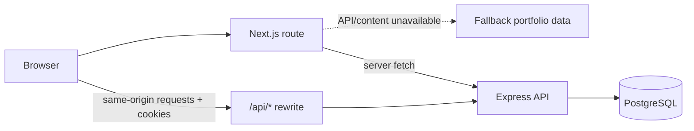

<div align="center">


### A considered public portfolio. A capable private workspace.

[](https://nextjs.org/)
[](https://react.dev/)
[](https://www.typescriptlang.org/)
[](https://tailwindcss.com/)


[← Application overview](../README.md) · [API and database guide →](../server/README.md)

</div>

---

## Overview

The client is the public portfolio and admin experience for the application. It is built with the Next.js App Router and reads published profile content from the Express API. `/admin` provides a protected workspace for editing content, reviewing contact messages, and managing uploaded media.

The visual language pairs a deep-black canvas with electric-gold accents. Responsive layouts, reusable local UI components, and shared site navigation/footer keep the experience consistent across routes.

## Capabilities

- **Portfolio home:** profile, skills, work history, services, projects, testimonials, and contact form.
- **Editorial pages:** blog index and dynamic article pages.
- **Admin workspace:** login, session refresh, logout, content editing, publishing, ordering, media selection, message status changes, and deletion.
- **Accessible feedback:** form labels, loading states, live status messages, and visible API errors.
- **Same-origin API:** browser requests use `/api`; Next.js rewrites requests to the deployed server.

## Route map

| Route | Experience | Data source |
| --- | --- | --- |
| `/` | Portfolio home: profile, skills, experience, services, projects, testimonials, contact | `GET /api/portfolio`, with client fallback data |
| `/blog` | Published article listing | Published portfolio/blog data |
| `/blog/[slug]` | Article detail | Published article matched by slug |
| `/admin` | Sign-in and CMS dashboard | Authenticated Express endpoints |

The CMS supports profile editing, collection management, published/draft states, display ordering, contact-message status/deletion, and shared media selection.

## Rendering and request flow



The home page fetches its content on the server with `cache: "no-store"`. If the API cannot be reached or a collection has no published records, fallback data keeps the public presentation usable. Testimonials intentionally remain empty unless published content exists.

Admin API requests include credentials. Access cookies are short-lived and refreshed by the dashboard when needed; the backend—not the rendered UI—enforces authorization for private operations.

## Stack

- Next.js 16 App Router and React 19
- TypeScript 5
- Tailwind CSS 4
- Local shadcn-style components built with Base UI
- Lucide icons
- ESLint

## Local development

### Prerequisites

- Node.js 20+
- npm
- The Express API running locally (see [Server guide](../server/README.md))

From the repository root:

```powershell
cd client
Copy-Item .env.example .env.local
npm install
npm run dev
```

Open [http://localhost:3000](http://localhost:3000). The CMS is available at `/admin`; blog routes are `/blog` and `/blog/[slug]`.

### Environment

| Variable | Local default | Purpose |
| --- | --- | --- |
| `NEXT_PUBLIC_API_URL` | `/api` | Browser-facing API base path |
| `CMS_API_URL` | `http://localhost:10000/api` | Server-side rewrite destination |

For local development, `.env.example` already contains the local API destination. In production, set `CMS_API_URL` to the deployed API base URL, including `/api`. Do not put database credentials, JWT secrets, admin passwords, or email-provider keys in client environment variables.

## Data and API behavior

The home page requests `GET /api/portfolio`; the API returns the profile and published collections together. Blog pages consume published articles. If the API is unavailable or content is absent, the client includes fallback portfolio/blog content so the public page can still render.

The browser sends CMS requests to `/api` with credentials enabled. The `next.config.ts` rewrite forwards those requests to `CMS_API_URL`, keeping the browser on the client origin for cookie-based sessions. Admin access is enforced by the API; client-side route display is not a security boundary.

Contact submissions are posted to `/api/contact`. A saved message can still exist when its email notification fails; the UI distinguishes provider acceptance, unconfigured mail, and known delivery errors. Provider acceptance is not a guarantee of inbox placement.

### UI and UX principles

- **Responsive by default:** portfolio sections and CMS controls adapt across narrow and wide viewports.
- **Consistent visual hierarchy:** black surfaces, gold highlights, and reusable typography/components support a recognizable visual system.
- **Feedback for state changes:** sign-in, saves, uploads, contact submission, and destructive actions expose loading, success, or error states.
- **Shared content references:** uploaded media can be selected in profile and content fields instead of requiring separate uploads for each section.
- **Semantic interactions:** forms have labels; async contact feedback uses a live region; destructive message deletion requires confirmation.

## Deploy to Vercel

1. Import the GitHub repository into Vercel.
2. Set **Root Directory** to `client`.
3. Keep the detected Next.js framework, install, build, and output settings.
4. Add the following environment variables to Production; add them to Preview only if preview deployments should connect to the API:

   | Name | Value |
   | --- | --- |
   | `NEXT_PUBLIC_API_URL` | `/api` |
   | `CMS_API_URL` | `https://<your-render-service>.onrender.com/api` |

5. Deploy or redeploy after setting the variables. Next.js uses `CMS_API_URL` to construct the API rewrite.
6. In the Render Web Service, set `CLIENT_ORIGIN` to the exact Vercel production origin and redeploy the API.
7. Verify the public homepage, a blog route, admin login/logout, one content save, a media upload, and a contact submission.

Do not configure a direct browser-to-Render URL unless you intentionally want cross-origin cookies and have configured CORS for that setup. The repository’s normal deployment path uses the Vercel same-origin rewrite.

## Commands

```powershell
npm run dev       # Start local development server
npm run lint      # Run ESLint
npm run build     # Create a production build
npm run start     # Serve a previously built app
```

The app uses `next/font` for Space Grotesk, Space Mono, and Geist. A production build therefore needs network access to fetch the fonts during the build unless the font setup is changed to use local assets.

From the repository root:

```powershell
npm --prefix client run lint
npm --prefix client run build
```

## Project structure

```text
src/
  app/
    admin/          Admin route
    blog/           Blog index and article route
    globals.css     Site and CMS styles
    layout.tsx      Root layout and metadata
    page.tsx        Portfolio home
  components/
    ui/             Shared interface primitives
    admin-dashboard.tsx
    portfolio.tsx
    site-chrome.tsx
  lib/
    portfolio-data.ts  Types, fetch logic, and fallback content
    utils.ts           Shared UI utilities
```

## Verification checklist

Before publishing a frontend release, validate the production build and the integrated user paths:

```powershell
npm run lint
npm run build
```

Then verify `/`, `/blog`, an article route, admin sign-in and sign-out, a content save, an upload, and the contact form against the intended API environment. The client’s build/lint checks do not replace an end-to-end check against the deployed backend.

## More documentation

- [Application overview and deployment](../README.md)
- [Express API, database, and email](../server/README.md)

<div align="center">

**A considered interface, from first visit to content update.**

</div>
