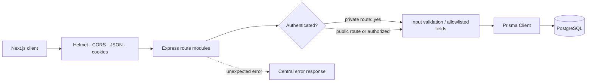

<div align="center">


### Clear API boundaries. Persistent content. Protected editorial workflows.

[](https://nodejs.org/)
[](https://expressjs.com/)
[](https://www.prisma.io/)
[](https://www.postgresql.org/)


[← Application overview](../README.md) · [Web client guide →](../client/README.md)

</div>

---

## Overview

This service powers the portfolio and admin workspace. It provides public portfolio data, protected CMS operations, cookie-based authentication, message handling, and file uploads. PostgreSQL stores application data and uploaded file bytes; Prisma defines the data model and applies migrations.

## Responsibilities

| Area | Behavior |
| --- | --- |
| Content | Serves published content publicly and allows authenticated CRUD operations |
| Authentication | bcrypt password verification; short-lived JWT access and refresh cookies |
| Messages | Persists contact submissions, reports email outcome, supports admin review/archive/delete |
| Media | Authenticated uploads up to 10 MB; file data and metadata stored in PostgreSQL |
| Security | Helmet headers, origin allowlist, login/contact rate limits, protected mutation routes |
| Operations | `/api/health`, Prisma migrations, seed scripts, and structured error responses |

## Request lifecycle



Authentication uses an access token with a **15-minute** lifetime and a refresh token with a **7-day** lifetime. Both are HTTP-only cookies scoped to `/api`; production cookies are secure and use `SameSite=None` to support the application’s deployment topology. Login is limited to 10 attempts per 15 minutes per client IP; contact submissions are limited to 8 per hour.

## Stack

- Node.js, Express 5, JavaScript ES modules
- PostgreSQL and Prisma 6
- Nodemailer for local SMTP fallback
- Brevo transactional email API over HTTPS for production
- `bcrypt`, `jsonwebtoken`, `cookie-parser`, `helmet`, `cors`, `express-rate-limit`, and `multer`

## Local setup

### Requirements

- Node.js 20+
- npm
- PostgreSQL

From the repository root:

```powershell
cd server
Copy-Item .env.example .env
npm install
npm run db:generate
npm run db:migrate
npm run db:seed:content
npm run db:seed
npm run dev
```

With the supplied `.env.example`, the API listens on port `10000`. If `PORT` is unset, the server defaults to `5000`. Check `http://localhost:10000/api/health` with the example configuration.

### Environment variables

| Variable | Required | Description |
| --- | :---: | --- |
| `DATABASE_URL` | Yes | PostgreSQL application connection |
| `DIRECT_URL` | Yes | Direct PostgreSQL connection for Prisma migrations |
| `PORT` | No | Listening port; defaults to `5000` if not set |
| `CLIENT_ORIGIN` | Yes in production | Exact allowed browser origin; comma-separated origins are supported |
| `JWT_SECRET` | Yes | Random secret of at least 32 characters |
| `JWT_REFRESH_SECRET` | Yes | Different random secret of at least 32 characters |
| `ADMIN_NAME` | For admin seed | Display name for the seeded admin |
| `ADMIN_EMAIL` | For admin seed | Admin sign-in address |
| `ADMIN_PASSWORD` | For admin seed | Password of at least 12 characters |
| `SMTP_HOST`, `SMTP_PORT`, `SMTP_SECURE` | Local fallback | SMTP relay settings; defaults to port 587 when applicable |
| `SMTP_USER`, `SMTP_PASS` | Local fallback | SMTP login and SMTP key/password |
| `SMTP_FROM` | Email | Sender address verified with Brevo |
| `CONTACT_TO` | Email | Destination inbox for contact submissions |
| `BREVO_API_KEY` | Production email | Brevo API v3 key used by the HTTPS transactional-email endpoint |

`BREVO_API_KEY` is intentionally absent from `.env.example`; add it manually to the ignored `server/.env` when using the API integration. The Brevo API key and SMTP key are different credentials. Production uses the HTTPS API and does not fall back to SMTP when the API key is missing. Local development can use either the API key or SMTP fallback. Never commit environment files or expose credentials in logs.

## API reference

All routes are mounted under `/api`.

### Public routes

| Method | Route | Description |
| --- | --- | --- |
| `GET` | `/health` | Process health check; no database query |
| `GET` | `/portfolio` | Profile and published portfolio collections |
| `GET` | `/about` | Public profile |
| `GET` | `/skills`, `/projects`, `/blogs`, `/experience`, `/testimonials`, `/services` | Published collection records |
| `POST` | `/contact` | Validate and save a message, then attempt email notification |
| `GET` | `/media/files/:id` | Serve an image inline or download another file |
| `POST` | `/auth/login` | Sign in; rate-limited |
| `POST` | `/auth/refresh` | Refresh an existing session |
| `POST` | `/auth/logout` | Expire auth cookies |

### Authenticated routes

Send the HTTP-only session cookies established by sign-in.

| Method | Route | Description |
| --- | --- | --- |
| `GET` | `/auth/me` | Return the current admin |
| `GET` | `/:collection?admin=true` | Read a collection including drafts |
| `POST` | `/:collection` | Create a content record |
| `PUT` | `/:collection/:id` | Update a content record |
| `DELETE` | `/:collection/:id` | Delete a content record |
| `PUT` | `/about` | Create or update the portfolio profile |
| `GET` | `/messages` | List recent contact messages |
| `PATCH` | `/messages/:id` | Update message status (`NEW`, `READ`, or `ARCHIVED`) |
| `DELETE` | `/messages/:id` | Delete a message |
| `GET` | `/media` | List media-library records |
| `POST` | `/upload/image` | Upload one multipart file using the `image` field |

Supported content collections are `skills`, `projects`, `blogs`, `experience`, `testimonials`, and `services`. The `about` profile is a single record and uses `PUT /about`.

### Payload and status conventions

- Public reads return published records; admin collection reads use `?admin=true` and require the access cookie.
- Create routes return `201`; successful deletes return `204`.
- Validation failures return `400`; unauthenticated requests return `401`; duplicate unique values return `409`; unavailable database/media schema conditions can return `503`.
- Contact submission returns `201` when the message is saved, even if notification delivery fails. Inspect `emailStatus` and `emailError` to distinguish notification outcomes.

### Contact delivery

`POST /contact` accepts JSON containing `name`, `email`, and `message`; `subject` is optional. The API saves the message before attempting email delivery so the CMS retains submissions if a provider is unavailable.

When `BREVO_API_KEY`, `SMTP_FROM`, and `CONTACT_TO` are present, the API calls Brevo’s HTTPS endpoint. It sends from the verified sender, routes to `CONTACT_TO`, and sets the visitor’s address as `Reply-To`. In local development, Nodemailer SMTP settings are supported as a fallback when no Brevo API key is configured.

The response includes `emailStatus` (`sent`, `failed`, or `not_configured`) and a safe diagnostic `emailError` code. `sent` means the provider accepted the request; it does not guarantee inbox delivery. For a Brevo `401`, check the API v3 key configured in the environment and Brevo’s API-key IP authorization policy. A Brevo SMTP key is not an API key.

| `emailError` | Meaning | First check |
| --- | --- | --- |
| `BREVO_API_KEY_MISSING` | Production has no complete HTTPS email configuration | Render `BREVO_API_KEY`, `SMTP_FROM`, and `CONTACT_TO` |
| `BREVO_AUTH` | Brevo rejected the API request with 401/403 | API v3 key, correct Brevo account, authorized outbound IPs |
| `BREVO_SENDER` | Brevo rejected the request as invalid | Sender address is verified and formatted correctly |
| `BREVO_UNAVAILABLE` | Provider throttled or returned a server failure | Brevo status and transactional logs |
| `BREVO_NETWORK` | API request failed before an HTTP response | Service outbound HTTPS/network and timeout logs |

## Database and files

Prisma models include `User`, `About`, `Skill`, `Project`, `Blog`, `Experience`, `Testimonial`, `Service`, `Media`, and `Message`.

| Command | Use |
| --- | --- |
| `npm run db:generate` | Generate Prisma Client |
| `npm run db:migrate` | Create/apply migrations during local development |
| `npm run db:migrate:deploy` | Apply checked-in migrations in deployment |
| `npm run db:seed:content` | Upsert starter portfolio content |
| `npm run db:seed` | Create or update the admin account |
| `npm run db:studio` | Open Prisma Studio |

File uploads are held in memory for the request and stored as `Bytes` in the `Media` table. The maximum accepted upload is 10 MB. This keeps media persistent across ephemeral web instances, but it uses database storage and backup capacity; use appropriately sized database storage and backups as the library grows.

## Deploy as a manual Render Web Service

1. Create a Render **Web Service** connected to the repository.
2. Set **Root Directory** to `server` and runtime to Node.
3. Set the **Build Command** to `npm ci && npm run db:generate`.
4. Set the **Start Command** to `npm run db:migrate:deploy && npm start`.
5. Set **Health Check Path** to `/api/health`.
6. Add production environment variables: `NODE_ENV=production`, `DATABASE_URL`, `DIRECT_URL`, `JWT_SECRET`, `JWT_REFRESH_SECRET`, `ADMIN_NAME`, `ADMIN_EMAIL`, `ADMIN_PASSWORD`, `CLIENT_ORIGIN`, `SMTP_FROM`, `CONTACT_TO`, and `BREVO_API_KEY`.
7. Deploy and verify `https://<service>.onrender.com/api/health` returns `{"status":"ok"}`.
8. Seed the initial admin against the production database from a trusted local environment using `npm run db:seed`.

If Brevo API-key IP authorization is enabled, authorize the Render service’s outbound IPs in Brevo. Set the client-side Next.js rewrite to this service URL in Vercel (`CMS_API_URL=https://<service>.onrender.com/api`). The Vercel production origin must exactly match Render’s `CLIENT_ORIGIN`.

The repository root [Render Blueprint](../render.yaml) is optional; it is not required when configuring a Web Service manually.

### Post-deploy smoke checks

1. `GET /api/health` returns `200` with `{"status":"ok"}`.
2. The first authenticated CMS request can refresh or establish the admin session.
3. A content update is visible through the public portfolio endpoint.
4. A small media upload is stored and served again from `/api/media/files/:id`.
5. A contact submission appears in the CMS Messages view.
6. A test email is accepted by Brevo and appears in its transactional logs; confirm inbox/spam placement separately.

## Tests and commands

```powershell
npm test
npm start
```

From the repository root, run:

```powershell
npm --prefix server test
```

The API tests exercise route behavior and mock SMTP/Brevo requests. They do not send real email.

## Structure

```text
src/
  app.js                 Express middleware and route mounting
  server.js              Environment validation and process startup
  db.js                  Prisma client
  middleware/auth.js     JWT cookie creation, refresh, and authorization
  routes/
    auth.routes.js
    contact.routes.js
    content.routes.js
    portfolio.routes.js
    upload.routes.js
prisma/
  schema.prisma
  migrations/
  seed.js
  seed-content.js
test/
  api.test.js
```

## Related documentation

- [Full application guide and deployment](../README.md)
- [Next.js client guide](../client/README.md)

<div align="center">

**Small, explicit APIs. Persistent data. Secure admin workflows.**

</div>
